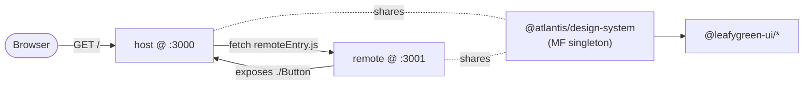
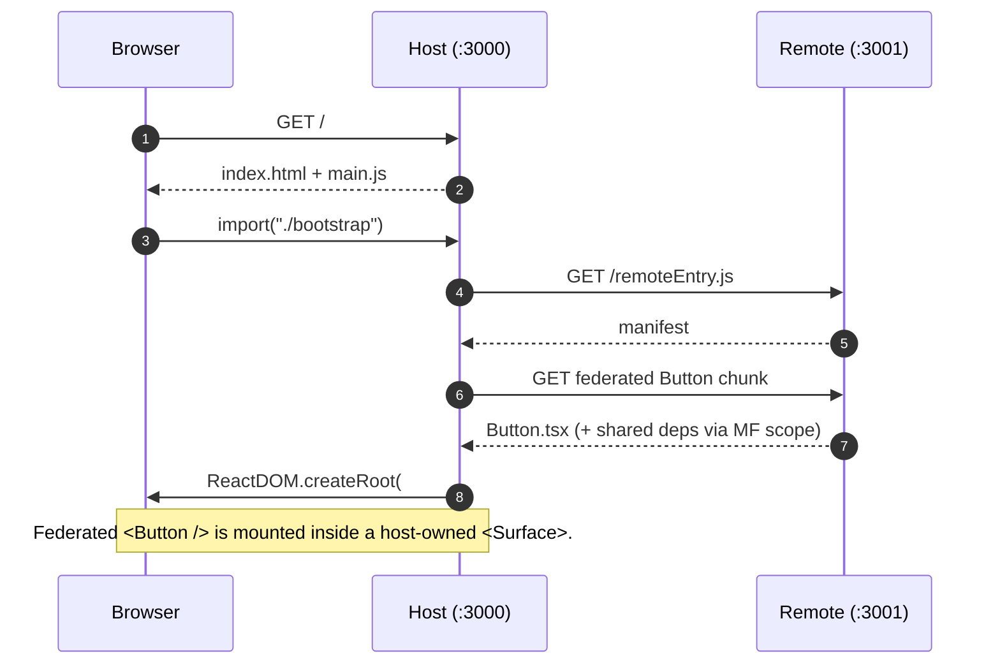
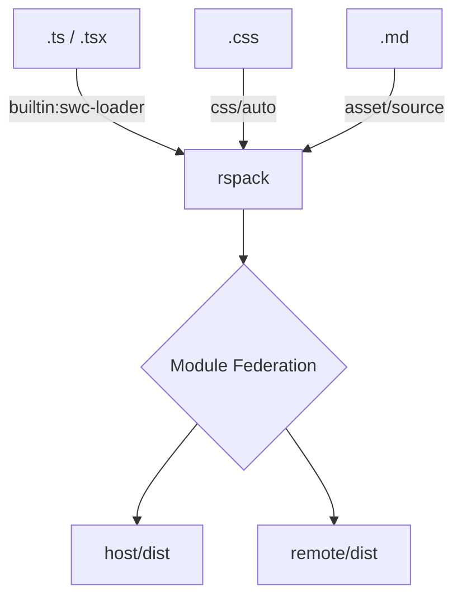

# Architecture

This app is a **micro-frontend** scaffold: a shell **host** loads a remote
**micro-frontend** at runtime via Module Federation. React, ReactDOM, and the
design system are shared as singletons so a single React tree owns the page.

## Runtime topology

## Boot sequence

## Build pipeline

## Why this layout

> [!TIP]
> Each app owns its build deps (`@rspack/*`, react, etc.) because pnpm doesn't
> hoist by default. Cross-cutting tools (ESLint, Prettier, TypeScript) live at
> the workspace root.

> [!NOTE]
> The bespoke design-system is **source-only** — apps import `.tsx` directly
> and their SWC pipeline transpiles it. No publish step, no build.
