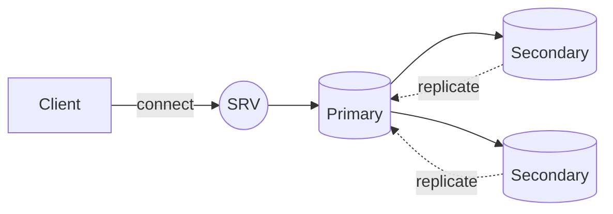
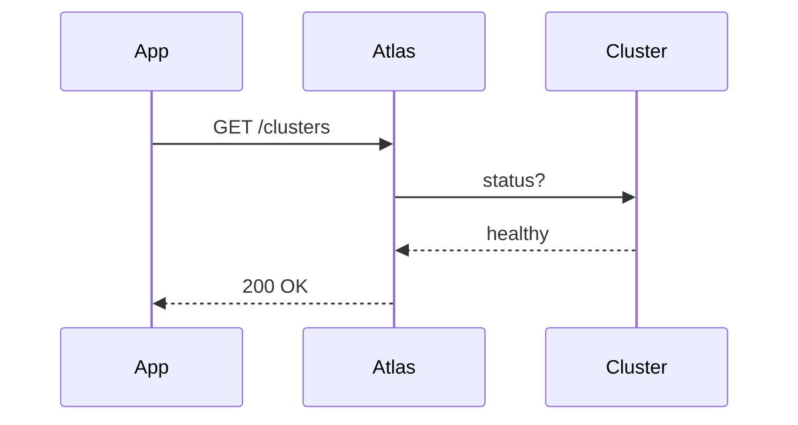
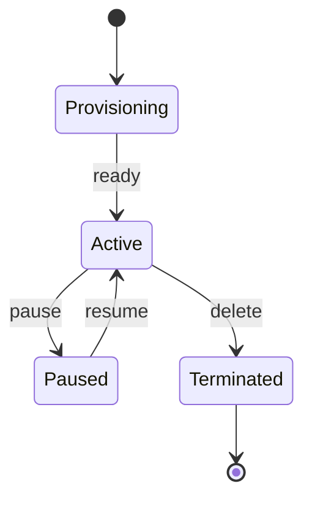

# Mermaid diagrams

Fenced blocks tagged ` ```mermaid ` are detected by `<Markdown />` and routed
to the `<Mermaid />` component, which lazy-loads the `mermaid` library and
renders the diagram as SVG. The diagram picks up the active palette via the
`data-theme` on the surrounding `atlas-root`.

## Flowchart



## Sequence diagram



## State diagram


